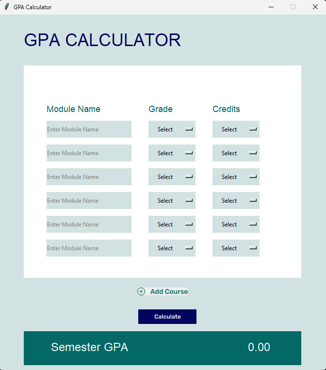

# 🎓 GPA Calculator – Python Tkinter GUI

This is a desktop GUI application built with **Python** and **Tkinter**, designed to calculate **semester GPA** based on user input for course names, grades, and credit values.

The UI was initially designed using **Figma** and converted to functional Python code using **Tkinter Designer**. Logic and features were then added using Python and `tkinter.ttk`.

---

## 🚀 Features

- 🎯 Input up to **7 courses**
- 🎓 Select grades from dropdown (A to F)
- 🔢 Input course credit values
- 📐 Real-time **GPA calculation**
- ♻️ Individual **clear buttons** for each row
- ➕ Add new course rows dynamically
- 💡 Clean and responsive interface (based on Figma design)

---

## 🖼️ GUI Screenshot

> 

---

## 🛠️ Tech Stack

| Tool | Purpose |
|------|---------|
| **Python** | Core programming language |
| **Tkinter** | GUI library for Python |
| **Tkinter.ttk** | For dropdown (Combobox) widgets |
| **Figma** | UI design |
| **Tkinter Designer** | Convert Figma designs to Tkinter layout code |

---

## 🧩 What is Tkinter Designer?

**[Tkinter Designer](https://github.com/ParthJadhav/Tkinter-Designer)** is an open-source tool that allows developers to design GUI layouts using **Figma**, and then export them directly to **Tkinter Python code**. This saves time and allows modern UI design with less manual layout coding.

### 🧪 How it worked in this project:
1. The layout was built visually in Figma.
2. Exported using Tkinter Designer as `.py` with asset folders.
3. Python logic (GPA calculation, button actions) was manually added to the generated base code.


---

## 🧮 Grade Mapping Table

| Grade | Value |
|-------|-------|
| A     | 4.0   |
| A-    | 3.7   |
| B+    | 3.3   |
| B     | 3.0   |
| B-    | 2.7   |
| C+    | 2.3   |
| C     | 2.0   |
| C-    | 1.7   |
| D     | 1.0   |
| F     | 0.0   |

---

## ▶️ How to Run

1. Make sure you have **Python 3.8+** installed.
2. Clone or download the project.
3. Navigate into the folder.
4. Run the application:

```bash
python main.py
